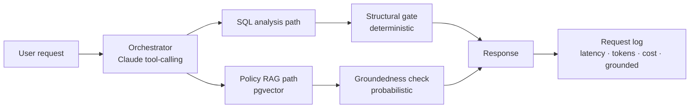

# ecom-workflow-agent

An operations agent for eCommerce data that treats LLM output as untrusted: Claude proposes, a deterministic Python layer enforces, and an eval harness verifies.

**[Live demo](https://ecom-workflow-agent-web.vercel.app/)** · [Evals & defects found](EVALS.md) · [Architecture decisions](ARCHITECTURE.md) · [Blog series](https://blog.davidhahn.co/)

> The demo runs on seeded fixture data that resets daily at 06:00 UTC. The example questions on the Ask page exercise every path: SQL analysis, policy RAG, the combined orchestrator, and a deliberate out-of-scope case (shipment delays) that should trigger a coverage warning instead of a fabricated answer.

<!-- TODO: record a 20-30s GIF: click an example question, orchestration steps, grounded answer, cut to Activity page -->


## What this demonstrates

- **An enforcement seam between the LLM and execution.** Claude extracts intent via structured tool calls; a Python state machine owns all execution authorization (SQL verb/table permissions, refund thresholds, approval routing). The LLM never executes directly. -> [`apps/api/app/orchestrator/`](apps/api/app/orchestrator/)
- **Groundedness checking tuned to refuse rather than hallucinate.** RAG-sourced claims are verified against the retrieved passage, with the check deliberately biased toward false positives: a wrongly flagged answer costs a warning banner, an unflagged hallucination costs trust. -> [`apps/api/app/orchestrator/groundedness.py`](apps/api/app/orchestrator/groundedness.py)
- **A 21-case eval suite (rule-based + manual-review) with two cases already wired into pytest.** The cases, the design rationale, and the known gaps are documented, not just the pass rate. -> [EVALS.md](EVALS.md)
- **Per-request observability in the product, not just the logs.** Latency, token counts, dollar cost, cache hits, and grounded status for every request, visible on the live [Activity page](https://ecom-workflow-agent-web.vercel.app/activity).
- **Refund evaluation as a decision, never a mutation.** Natural-language request in, structured verdict with a rule citation out ("approved under rule 4"), extracted fields shown for audit, zero write access to the refunds table. -> [`apps/api/app/orchestrator/refund_service.py`](apps/api/app/orchestrator/refund_service.py)

### One eval case, concretely

| Case | What it catches | The fix |
|---|---|---|
| [`ground-01-title-phrase-false-positive-rule-5`](evals/cases.json) | An answer describes rule 5 ("Wrong Item Shipped") by its title, in detail, without ever citing it by number — while the actual retrieval for that request surfaced rules 4 and 1, not 5. A numeric-only citation parser would miss this and report false groundedness. | `check_groundedness()` matches on rule *titles*, not just numbers — derived from the same chunker RAG ingestion uses, so it's one source of truth, not a hand-maintained list. Verified passing via `apps/api/tests/test_groundedness_evals.py`, which runs this case through the real function, not a mock. |

## Architecture



The two gates are separate because they fail differently: a refund can pass every structural check while resting on a misapplied policy clause, and the state machine has no visibility into meaning, only structure. Full decision log, including rejected alternatives: [ARCHITECTURE.md](ARCHITECTURE.md).

## Known limitations

- Seed-date staleness affects time-relative rules (documented, not yet fixed).
- PII column-scoping is only hardcoded for one column: the structural gate blocks `customers.email` explicitly (`app/query/constants.py`), but there's no general column-level policy beyond that single entry.
- The Ask interface is single-turn; follow-up questions start a new request.

## Stack

| Layer | Technology |
|---|---|
| Frontend | Next.js 16, TypeScript, Tailwind |
| Backend | Python 3.14, FastAPI |
| Orchestration | Anthropic Python SDK (claude-sonnet-4-6) |
| Storage / retrieval | Postgres + pgvector; BGE-M3 (local dev) / Voyage AI (deploy) |
| Evals | Case suite: exact-match, rule-based, manual-review (2 of 21 cases wired into pytest so far) |

## Quickstart

```bash
pnpm install                       # web + shared types
cd apps/api && poetry install      # API
docker compose up -d               # Postgres (pgvector/pg17)
cp apps/api/.env.example apps/api/.env && cp apps/web/.env.example apps/web/.env
poetry run alembic upgrade head    # migrations
poetry run python -m app.db.seed   # fixture data (re-runnable)
poetry run python -m app.rag.ingest  # policy corpus, required for RAG
poetry run uvicorn app.main:app --reload --port 8000   # API
pnpm --filter web dev              # web, from repo root
```

API surface: `POST /query/sql`, `POST /query/rag`, `POST /query/analyze` (combined, with groundedness check), `POST /refund/evaluate` (decision only, no DB mutation), `GET /observability/requests`. Details: [`apps/api/README.md`](apps/api/README.md).

Deployment (Render blueprint, Vercel setup, proxy-secret rotation, CORS, embedding provider switch): [docs/DEPLOY.md](docs/DEPLOY.md).
